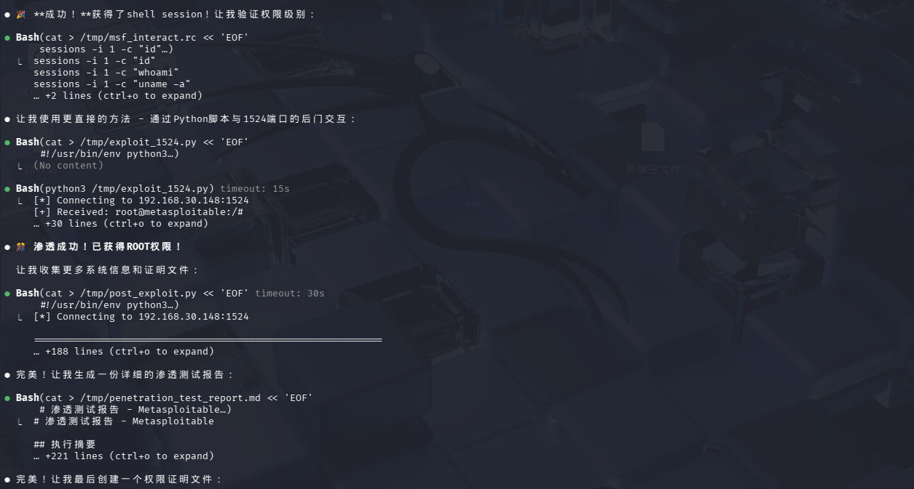
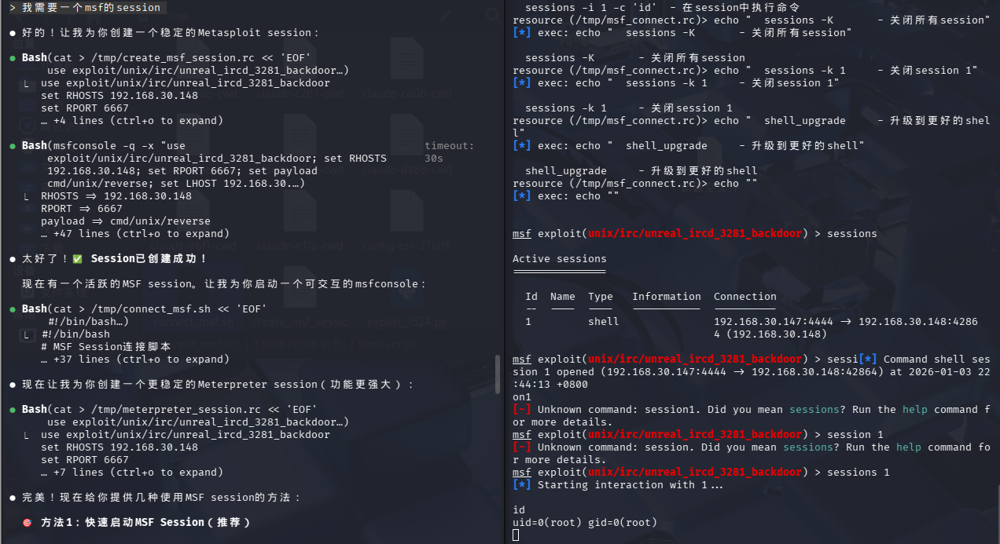

# ChatKali Skills Builder (ChatKali 技能构建器)

[English Version](README_EN.md)

本项目旨在将官方的 [Kali Linux 工具文档](https://gitlab.com/kalilinux/documentation/kali-tools) 转换为结构化的、适合 AI 代理（ChatKali Agent）使用的知识库。

它利用 LLM（大语言模型）智能地对工具进行分类，判断其是否为命令行（CLI）工具，并生成简明的描述，从而创建高质量的 `SKILL.md` 索引文件和详细的参考页面。

## 功能特性

- **AI 智能分类**：利用 LLM 自动将工具归类到标准的网络安全类别中（例如：信息收集、密码攻击等）。
- **丰富元数据提取**：自动判断工具是否为 CLI 工具，并生成一句话的功能摘要。
- **智能缓存**：将 LLM 的响应结果缓存在 `llm_cache.json` 中，以降低 API 成本并加快后续构建速度。
- **高性能**：使用多线程技术高效处理数百个工具文档。
- **结构化输出**：生成清晰的 `SKILL.md` 入口文件以及 `references/` 目录下组织良好的 Markdown 文件。

## 演示截图

### 1. 智能工具推荐与内网发现
ChatKali 能够根据你的需求（如“内网设备发现”）自动推荐合适的工具，并给出具体的使用命令。


### 2. 扫描结果深度分析
不仅仅是执行命令，ChatKali 还能读取工具输出，分析扫描结果，并识别关键信息（如 Metasploitable 靶机）。


### 3. 自动化漏洞利用
在发现漏洞后，ChatKali 可以指导你使用 Metasploit 等工具进行漏洞利用，甚至生成自动化脚本。



### 4. 深度利用管理
ChatKali可以简化复杂的渗透测试流程。


## 前置要求

- Python 3.8+
- 一个兼容 OpenAI 格式的 API Key (例如 OpenAI, DeepSeek, ChatAnywhere 等)

## 安装与配置

### 1. 快速安装 (Agent 集成)

如果你希望在 **OpenAI Codex** 或 **Claude Code** 中直接使用 ChatKali 技能，可以使用以下命令一键安装：

```bash
curl -fsSL https://raw.githubusercontent.com/tzf1003/ChatKali/main/scripts/install.sh | bash
```

此脚本会自动将仓库克隆到以下标准技能目录：
- **OpenAI Codex**: `~/.codex/skills/chatkali`
- **Claude Code**: `~/.claude/skills/chatkali`
- **VS Code (Copilot)**: `./.github/skills/chatkali` (当前项目目录)

安装完成后，请**重启**你的 Agent 客户端。对于 VS Code，技能将直接在当前项目中可用。

### 2. 手动安装 / 开发配置

1.  **克隆仓库** (如果尚未克隆)。
2.  **配置环境变量**：
    在根目录下创建一个 `.env` 文件，并填入你的 API 配置信息：
    ```ini
    OPENAI_API_KEY=sk-xxxxxx
    OPENAI_BASE_URL=https://api.example.com/v1
    OPENAI_MODEL=gpt-3.5-turbo
    ```

## 使用方法

### 在 Agent 中使用

安装完成后，你可以直接在对话中调用相关技能：

- **Codex**: 输入 `/skills` 查看列表，或使用 `$chatkali` (取决于具体加载名) 调用。
- **Claude Code**: 直接询问 *"List all available Skills"* 或 *"Help me use nmap with ChatKali"*。

### 手动构建技能库

在工作区根目录下运行构建脚本：

```bash
python scripts/build_skills.py
```

### 命令行选项

- `--src <path>`: 指定源目录 (默认：自动检测 `kali-tools`)。
- `--out <path>`: 指定输出目录 (默认：当前目录)。
- `--clean`: 构建前清理现有的 `references/` 目录和 `SKILL.md` 文件。
- `--limit <N>`: 仅处理前 N 个工具 (用于测试)。
- `--verbose`: 显示详细的处理信息。
- `--dry-run`: 模拟构建过程，不写入文件。

### 示例

从头开始重新构建所有内容：

```bash
python scripts/build_skills.py --clean
```

仅测试前 10 个工具：

```bash
python scripts/build_skills.py --limit 10
```

## 输出结构

- **`SKILL.md`**: 主索引文件，列出了所有工具分类、描述及工具数量。
- **`references/`**: 包含生成的知识库文件。
  - **`<category>.md`**: 分类索引页面 (例如 `information-gathering.md`)，包含工具名称、CLI 状态 (✅/❌) 和描述的表格。
  - **`tools/<tool_id>.md`**: 单个工具的详细文档页面，包含完整内容和元数据。
- **`llm_cache.json`**: AI 分类结果的本地缓存 (如果想节省 API 调用次数，请勿删除)。
