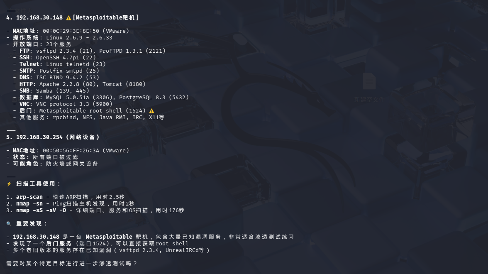
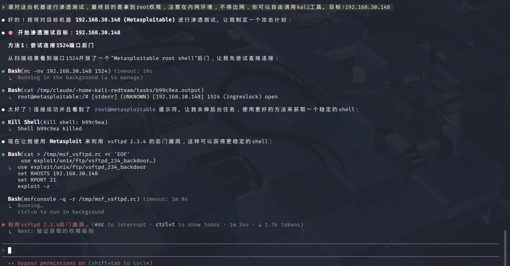

# ChatKali Skills Builder

This project converts the official [Kali Linux Tools documentation](https://gitlab.com/kalilinux/documentation/kali-tools) into a structured, AI-ready knowledge base for ChatKali agents.

It uses an LLM (Large Language Model) to intelligently classify tools, determine if they are CLI-based, and generate concise descriptions, creating a high-quality `SKILL.md` index and detailed reference pages.

## Features

- **AI-Powered Classification**: Automatically categorizes tools into standard cybersecurity categories (e.g., Information Gathering, Password Attacks) using an LLM.
- **Rich Metadata Extraction**: Determines if a tool is a CLI utility and generates a one-sentence summary.
- **Smart Caching**: Caches LLM responses in `llm_cache.json` to minimize API costs and speed up subsequent builds.
- **High Performance**: Uses multi-threading to process hundreds of tools efficiently.
- **Structured Output**: Generates a clean `SKILL.md` entry point and organized Markdown files in `references/`.

## Screenshots

### 1. Smart Tool Recommendation & Discovery
ChatKali automatically recommends suitable tools based on your intent (e.g., "network discovery") and provides specific commands.


### 2. Deep Analysis of Scan Results
Beyond executing commands, ChatKali parses tool outputs to identify critical information (e.g., identifying a Metasploitable target).


### 3. Automated Exploitation
Upon finding vulnerabilities, ChatKali guides you through exploitation using tools like Metasploit, and can even generate automation scripts.


### 4. Metasploit Session Management
With deep MSF integration, ChatKali helps you create, manage, and interact with Metasploit Sessions, streamlining complex pentesting workflows.


## Prerequisites

- Python 3.8+
- An OpenAI-compatible API Key (e.g., OpenAI, DeepSeek, etc.)

## Setup

### 1. Quick Install (Agent Integration)

To automatically install ChatKali skills for **OpenAI Codex** and **Claude Code**, run this one-line command:

```bash
curl -fsSL https://raw.githubusercontent.com/tzf1003/ChatKali/main/scripts/install.sh | bash
```

This script clones the repository into the standard skill directories:
- **OpenAI Codex**: `~/.codex/skills/chatkali`
- **Claude Code**: `~/.claude/skills/chatkali`
- **VS Code (Copilot)**: `./.github/skills/chatkali` (Current project directory)

Please **restart** your Agent client after installation. For VS Code, the skills will be available immediately in your current project.

### 2. Manual Setup / Development

1.  **Clone the repository** (if you haven't already).
2.  **Install dependencies** (standard Python libraries used: `requests`, `concurrent.futures`).
3.  **Configure Environment**:
    Create a `.env` file in the root directory with your API configuration:
    ```ini
    OPENAI_API_KEY=sk-xxxxxx
    OPENAI_BASE_URL=https://api.example.com/v1
    OPENAI_MODEL=gpt-3.5-turbo
    ```

## Usage

### Using with Agents

Once installed, you can access the skills directly in your chat:

- **Codex**: Type `/skills` to verify, or use `$chatkali` (depending on loader) to invoke.
- **Claude Code**: Ask *"List all available Skills"* or *"Help me use nmap with ChatKali"*.

### Building the Knowledge Base

Run the build script from the workspace root:

```bash
python scripts/build_skills.py
```

### Options

- `--src <path>`: Specify source directory (default: auto-detects `kali-tools`).
- `--out <path>`: Specify output directory (default: current directory).
- `--clean`: Remove existing `references/` and `SKILL.md` before building.
- `--limit <N>`: Process only the first N tools (useful for testing).
- `--verbose`: Show detailed processing information.
- `--dry-run`: Simulate the build without writing files.

### Example

Rebuild everything from scratch:

```bash
python scripts/build_skills.py --clean
```

Test with just 10 tools:

```bash
python scripts/build_skills.py --limit 10
```

## Output Structure

- **`SKILL.md`**: The main index file listing all tool categories with descriptions and counts.
- **`references/`**: Contains the generated knowledge base.
  - **`<category>.md`**: Category index pages (e.g., `information-gathering.md`) with tables showing Tool Name, CLI status, and Description.
  - **`tools/<tool_id>.md`**: Individual tool documentation pages with full content and metadata.
- **`llm_cache.json`**: Local cache of AI classifications (do not delete if you want to save API calls).
